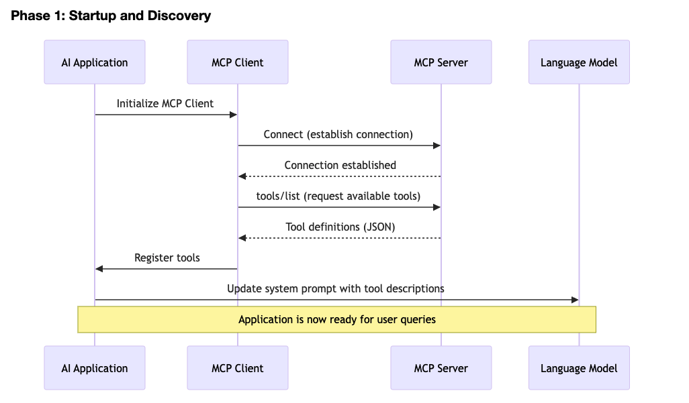
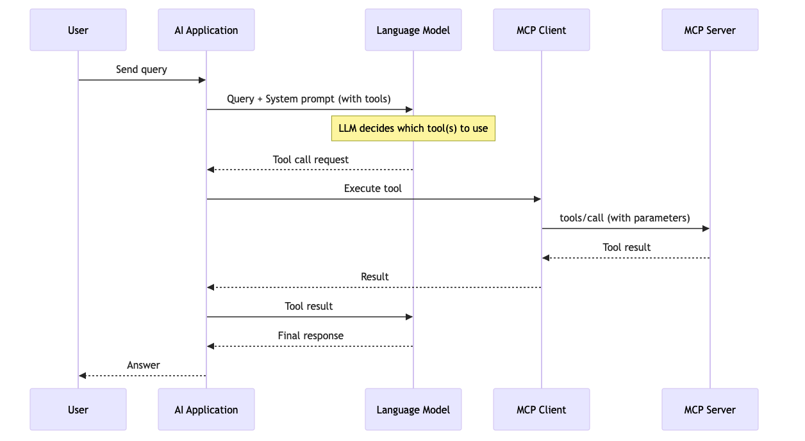

# Model Context Protocol (MCP)

<details>
<summary><strong>🌟 Introduction</strong></summary>

The Model Context Protocol (MCP) is an **open standard** that enables seamless, real-time communication between AI models (the intelligence layer) and external tools, data sources, and services. It provides a standardized way for AI applications to access **real-time context** and perform **external actions**, making AI systems more powerful, current, and contextually aware.

</details>

---

<details>
<summary><strong>🎯 Understanding the MCP Acronym</strong></summary>

**Quick Definition:**
- **M**odel = Intelligence
- **C**ontext = Information
- **P**rotocol = Standard

Before diving into what MCP does, let's break down what each word means:

### **Model**
In the context of MCP, a **Model** refers to an AI model (such as Large Language Models like GPT, Claude, or other machine learning models). These models are the intelligence layer that generates responses, makes decisions, and provides value to applications. Models are trained on historical data and have limitations in accessing real-time information without external integrations.

### **Context**
**Context** refers to the relevant information, data, and knowledge required to make informed decisions or generate accurate responses. This includes:
- Real-time data from databases and APIs
- Organization-specific information
- User-specific details and history
- External system states and configurations

Without proper context, AI models may provide outdated, inaccurate, or generic responses. MCP enables models to access rich, dynamic context from multiple sources.

### **Protocol**
A **Protocol** is a standardized set of rules and specifications for communication between different systems. It defines:
- How messages are formatted
- How requests and responses are structured
- How errors are handled
- How systems establish and maintain connections

By establishing a standard protocol, different AI tools and external services can communicate seamlessly without requiring custom integration code for each combination.

</details>

---

<details>
<summary><strong>❓ What is MCP?</strong></summary>

MCP is a protocol that allows:
- **AI Models** to request information from external sources
- **External Services** to provide data and capabilities to AI models
- **Bidirectional Communication** through a standardized interface
- **Extensibility** by connecting multiple tools and services

It operates on a client-server architecture with clear separation of concerns, enabling modular and scalable AI applications.

</details>

---

<details>
<summary><strong>💡 The Problem MCP Solves</strong></summary>

Traditional AI models have significant limitations:

1. **Training Data Staleness:** AI models are trained on historical data and cannot access real-time information
2. **Limited Context:** Models lack access to organization-specific data, databases, and internal systems
3. **No External Actions:** Models cannot trigger workflows, send notifications, or interact with external services
4. **Integration Challenges:** Each AI tool requires custom integrations with every external service, leading to redundant code
5. **Lack of Standardization:** Without a standard protocol, integrations are inconsistent and difficult to maintain

</details>

---

<details>
<summary><strong>✅ The MCP Solution: Key Benefits</strong></summary>

MCP addresses these challenges by providing:

**1. Real-Time Context Access**
- AI models can query live databases, APIs, and external services
- Access to current information enables better, more accurate responses
- Example: An AI assistant can fetch current stock prices, weather data, or customer information

**2. Extensibility & Modularity**
- New tools and services can be added without modifying the core AI model
- Multiple servers can be connected to a single client
- Example: Add a new database server, CRM system, or email service independently

**3. Standardized Integration**
- One protocol for all integrations instead of custom solutions
- Reduces development time and maintenance overhead
- Language-agnostic communication ensures compatibility across different tech stacks

**4. AI Autonomy**
- Models can perform actions beyond simple text generation
- Execute database queries, trigger automations, send communications
- Example: AI can schedule meetings, create tickets, or update records in real-time

**5. Enterprise Readiness**
- Built-in security and authentication hooks
- Scalable architecture for enterprise deployments
- Clear separation of concerns enables better governance and control

### Real-World Scenarios Where MCP is Essential

| Scenario | Traditional Approach | With MCP |
|----------|-------------------|----------|
| **Customer Support AI** | Manual data entry to check customer history | AI directly queries customer database in real-time |
| **DevOps Automation** | Hardcoded scripts for each tool | MCP connects to monitoring, logging, and infrastructure servers |
| **Data Analysis** | Export data manually from various sources | AI queries multiple data sources through MCP servers |
| **Code Assistant** | Requires constant updates for new tools | Plugs into IDE, version control, and build systems via MCP |
| **Multi-Tool Workflow** | Custom integration for each combination | Single MCP client connects to multiple specialized servers |

</details>

---

<details>
<summary><strong>🏛️ Core Components</strong></summary>

### 1. MCP Host
The **MCP Host** is the machine or environment where the AI model or application runs. It initiates communication and orchestrates interactions between clients and servers.

**Responsibilities:**
- Manages the lifecycle of MCP connections
- Routes requests between clients and servers
- Handles authentication and security
- Coordinates resource allocation

### 2. MCP Client
The **MCP Client** is the consumer of services within the MCP architecture. Typically, this is an AI application, IDE plugin, or any software that needs access to external resources.

**Responsibilities:**
- Sends requests to MCP Servers
- Processes responses
- Handles errors and retries
- Maintains connection state

### 3. MCP Server
The **MCP Server** is the service provider that exposes tools, resources, or data through the MCP protocol.

**Types of MCP Servers:**
- **Tool Servers:** Provide callable functions or operations
- **Resource Servers:** Expose data and information
- **Prompt Servers:** Offer pre-built prompts or templates
- **Composite Servers:** Combine multiple capabilities

**Responsibilities:**
- Listen for incoming requests
- Execute operations or fetch data
- Return results in standardized format
- Handle connection management

</details>

---
<details>
<summary><strong>🏗️ MCP Architecture</strong></summary>

#### MCP Core structure 

```
┌─────────────┐
│   MCP Host  │
│  (contains) │
└──────┬──────┘
       │
       ├─────────────────────────┐
       │                         │
   ┌───▼────┐            ┌──────▼──┐
   │ Client │◄───────────┤ Server  │
   │        │  JSON-RPC  │         │
   │        ├───────────►│         │
   └────────┘            └─────────┘
       ▲                       ▲
       │   Message Exchange    │
       └───────────────────────┘
```
#### AI Application with MCP

```
┌────────────────────────────────────────────────────────────────┐
│                  MCP Host (AI Application)                     │
│                                                                │
│  ┌──────────────────────────────────────────────────────────┐  │
│  │                    Application Layer                     │  │
│  │  • User Interface                                        │  │
│  │  • Request Routing                                       │  │
│  │  • Response Handling                                     │  │
│  └────────────────┬─────────────────────────────────────────┘  │
│                   │                                            │
│  ┌────────────────▼─────────────────┐  ┌──────────────────┐    │
│  │         MCP Client               │  │   LLM Provider   │    │
│  │                                  │  │  (Claude, GPT,   │    │
│  │  • Connection Management         │◄─┤   Gemini, etc.)  │    │
│  │  • Tool Discovery                │  │                  │    │
│  │  • Request/Response Handling     │  │  • Tool Calling  │    │
│  │  • Protocol Implementation       │  │  • Reasoning     │    │
│  └────────────────┬─────────────────┘  └──────────────────┘    │
│                   │                                            │
└───────────────────┼────────────────────────────────────────────┘
                    │
                    │ MCP Protocol (JSON-RPC 2.0)
                    │ • tools/list
                    │ • tools/call
                    │ • resources/list
                    │ • prompts/list
                    │
┌───────────────────▼────────────────────────────────────────────┐
│                      MCP Server                                │
│                                                                │
│  ┌──────────────────────────────────────────────────────────┐  │
│  │                   Server Implementation                  │  │
│  │  • Tool Definitions                                      │  │
│  │  • Request Handling                                      │  │
│  │  • Business Logic                                        │  │
│  └────────────────┬─────────────────────────────────────────┘  │
│                   │                                            │
│  ┌────────────────▼─────────────────────────────────────────┐  │
│  │                    Data Sources                           │ │
│  │                                                           │ │
│  │  ┌──────────┐  ┌──────────┐  ┌──────────┐  ┌─────────┐    │ │
│  │  │ Database │  │  Files   │  │   APIs   │  │ Other   │    │ │
│  │  └──────────┘  └──────────┘  └──────────┘  └─────────┘    │ │
│  │                                                           │ │
│  └───────────────────────────────────────────────────────────┘ │
└────────────────────────────────────────────────────────────────┘
```
</details>

---

<details>
<summary><strong>📊 MCP Sequence Flow</strong></summary>


#### Phase 1: Startup and Discovery



#### Phase 2: Query Time Execution


#### MCP Tool Definition - Format
##### Raw MCP Server Response

When the MCP client requests `tools/list`, the server responds with JSON in this format:

```json
{
  "tools": [
    {
      "name": "read_file",
      "description": "Read the complete contents of a file from the file system. Handles various text encodings and provides detailed error messages if the file cannot be read.",
      "inputSchema": {
        "type": "object",
        "properties": {
          "path": {
            "type": "string",
            "description": "The absolute or relative path to the file to read"
          }
        },
        "required": ["path"]
      }
    },
    {
      "name": "search_database",
      "description": "Search the customer database using natural language queries. Returns matching records with relevance scores.",
      "inputSchema": {
        "type": "object",
        "properties": {
          "query": {
            "type": "string",
            "description": "The search query in natural language"
          },
          "limit": {
            "type": "integer",
            "description": "Maximum number of results to return",
            "default": 10,
            "minimum": 1,
            "maximum": 100
          },
          "filters": {
            "type": "object",
            "description": "Optional filters to narrow results",
            "properties": {
              "status": {
                "type": "string",
                "enum": ["active", "inactive", "pending"]
              },
              "created_after": {
                "type": "string",
                "format": "date"
              }
            }
          }
        },
        "required": ["query"]
      }
    },
    {
      "name": "execute_sql",
      "description": "Execute a SQL query against the connected database. Supports SELECT, INSERT, UPDATE, and DELETE operations with transaction support.",
      "inputSchema": {
        "type": "object",
        "properties": {
          "query": {
            "type": "string",
            "description": "The SQL query to execute"
          },
          "params": {
            "type": "array",
            "description": "Query parameters for prepared statements",
            "items": {
              "type": ["string", "number", "boolean", "null"]
            }
          },
          "timeout": {
            "type": "integer",
            "description": "Query timeout in seconds",
            "default": 30
          }
        },
        "required": ["query"]
      }
    }
  ]
}
```


#### How Tools Are Presented to the LLM

The MCP client transforms the tool definitions into a format suitable for the LLM's system prompt. The exact format depends on the LLM provider being used.

##### Example 1: Anthropic Claude Format

```xml
You are an AI assistant with access to tools via the Model Context Protocol.

You can invoke tools by writing a function_calls block like this:
<function_calls>
<invoke>
<tool_name>tool_name_here</tool_name>
<parameters>
<param_name>value</param_name>
</parameters>
</invoke>
</function_calls>

Available tools:

<tools>
<tool>
<name>read_file</name>
<description>
Read the complete contents of a file from the file system. Handles various text 
encodings and provides detailed error messages if the file cannot be read.
</description>
<parameters>
  <parameter>
    <name>path</name>
    <type>string</type>
    <required>true</required>
    <description>The absolute or relative path to the file to read</description>
  </parameter>
</parameters>
</tool>

<tool>
<name>search_database</name>
<description>
Search the customer database using natural language queries. Returns matching 
records with relevance scores.
</description>
<parameters>
  <parameter>
    <name>query</name>
    <type>string</type>
    <required>true</required>
    <description>The search query in natural language</description>
  </parameter>
  <parameter>
    <name>limit</name>
    <type>integer</type>
    <required>false</required>
    <description>Maximum number of results to return (default: 10, min: 1, max: 100)</description>
  </parameter>
  <parameter>
    <name>filters</name>
    <type>object</type>
    <required>false</required>
    <description>Optional filters: status (active|inactive|pending), created_after (date)</description>
  </parameter>
</parameters>
</tool>

<tool>
<name>execute_sql</name>
<description>
Execute a SQL query against the connected database. Supports SELECT, INSERT, 
UPDATE, and DELETE operations with transaction support.
</description>
<parameters>
  <parameter>
    <name>query</name>
    <type>string</type>
    <required>true</required>
    <description>The SQL query to execute</description>
  </parameter>
  <parameter>
    <name>params</name>
    <type>array</type>
    <required>false</required>
    <description>Query parameters for prepared statements</description>
  </parameter>
  <parameter>
    <name>timeout</name>
    <type>integer</type>
    <required>false</required>
    <description>Query timeout in seconds (default: 30)</description>
  </parameter>
</parameters>
</tool>
</tools>
```

##### Example 2: OpenAI Function Calling Format

```json
{
  "model": "gpt-4",
  "messages": [
    {
      "role": "system",
      "content": "You are an AI assistant with access to tools via MCP."
    }
  ],
  "tools": [
    {
      "type": "function",
      "function": {
        "name": "read_file",
        "description": "Read the complete contents of a file from the file system. Handles various text encodings and provides detailed error messages if the file cannot be read.",
        "parameters": {
          "type": "object",
          "properties": {
            "path": {
              "type": "string",
              "description": "The absolute or relative path to the file to read"
            }
          },
          "required": ["path"]
        }
      }
    },
    {
      "type": "function",
      "function": {
        "name": "search_database",
        "description": "Search the customer database using natural language queries. Returns matching records with relevance scores.",
        "parameters": {
          "type": "object",
          "properties": {
            "query": {
              "type": "string",
              "description": "The search query in natural language"
            },
            "limit": {
              "type": "integer",
              "description": "Maximum number of results to return",
              "default": 10,
              "minimum": 1,
              "maximum": 100
            },
            "filters": {
              "type": "object",
              "description": "Optional filters to narrow results",
              "properties": {
                "status": {
                  "type": "string",
                  "enum": ["active", "inactive", "pending"]
                },
                "created_after": {
                  "type": "string",
                  "format": "date"
                }
              }
            }
          },
          "required": ["query"]
        }
      }
    }
  ]
}
```

##### Example 3: Simplified Natural Language Format

Some implementations use a more human-readable format:

```
SYSTEM PROMPT:

You are an AI assistant with access to the following MCP tools:

1. **read_file**
   Purpose: Read the complete contents of a file from the file system
   Parameters:
   - path (required): The absolute or relative path to the file to read
   Example: read_file("/home/user/document.txt")

2. **search_database**
   Purpose: Search the customer database using natural language queries
   Parameters:
   - query (required): The search query in natural language
   - limit (optional): Maximum results to return (1-100, default: 10)
   - filters (optional): Object with status and/or created_after filters
   Example: search_database("customers in California", limit=20)

3. **execute_sql**
   Purpose: Execute SQL queries with transaction support
   Parameters:
   - query (required): The SQL query to execute
   - params (optional): Array of parameters for prepared statements
   - timeout (optional): Query timeout in seconds (default: 30)
   Example: execute_sql("SELECT * FROM users WHERE id = ?", params=[123])

When you need to use a tool, clearly indicate which tool and what parameters.
```

</details>

---

<details>
<summary><strong>📡 MCP Protocols</strong></summary>

MCP supports multiple transport protocols for flexibility:

### 1. **stdio (Standard Input/Output)**
- Uses process pipes for communication
- Ideal for local, single-machine deployments
- Low overhead
- No network latency
- Direct process-to-process communication

**Use Case:** Local AI applications communicating with MCP servers on the same machine

### 2. **HTTP**
- Traditional request-response model over HTTP/HTTPS
- Stateless communication
- Easier to debug and monitor
- Better for distributed systems over networks
- Standard port 80 (HTTP) or 443 (HTTPS)

**Use Case:** Cloud-based deployments, remote MCP servers accessible over the internet

### 3. **SSE (Server-Sent Events)**
- Server sends continuous data streams to client
- Built on top of HTTP
- One-way communication (server → client)
- Used for real-time notifications and updates
- Persistent HTTP connection

**Use Case:** Streaming responses, real-time updates from MCP servers

### Protocol Selection Guide

| Protocol | Best For | Limitations |
|----------|----------|------------|
| **stdio** | Local development, single machine | Not suitable for network communication |
| **HTTP** | Remote servers, internet-based | Stateless, higher overhead per request |
| **SSE** | Real-time streaming updates | One-way communication only |

<details>
<summary><strong>📊 Click to expand: Detailed Protocol Comparison Table</strong></summary>

### Protocol Comparison Table

| Feature | SSE | HTTP | stdio |
|---------|-----|------|-------|
| **One-way streaming** | ✅ Native | ❌ Not ideal | ✅ Yes |
| **Real-time updates** | ✅ Yes | ⚠️ Polling needed | ✅ Yes |
| **Setup complexity** | ✅ Simple | ✅ Simple | ✅ Simple |
| **Network usage** | ✅ Efficient | ❌ Higher overhead | ✅ Very efficient |
| **Browser support** | ✅ Modern browsers | ✅ All browsers | N/A |
| **Use in MCP** | ✅ Best for streaming | ✅ For request-response | ✅ For local |

</details>

</details>

---

<details>
<summary><strong>🔄 HTTP (Polling) vs. SSE (Pushing)</strong></summary>

### HTTP Architecture (Request-Response)

```
Application Layer (MCP Host):
┌─────────────────────────────────────────────┐
│         MCP Host (Your AI Application)      │
├─────────────────────────────────────────────┤
│                                             │
│  ┌────────────────────────────────────┐    │
│  │      MCP Client Component          │    │
│  │  (Established by your app)         │    │
│  │  - Sends request to MCP Server     │    │
│  │  - Waits for response              │    │
│  │  - Processes data                  │    │
│  │  - Polls repeatedly                │    │
│  └────────────────────────────────────┘    │
│                     │                       │
│      Request 1      │ Request 2      Request 3
│      (Poll every    │ (Poll every    (Poll every
│       2 seconds)    │  2 seconds)     2 seconds)
│        ▼            │   ▼              ▼
└─────────────────────┼──────────────────────┘
                      │
          ┌──────────────────────────┐
          │   MCP Server             │
          │  (Stock Feed Service)    │
          │  - Waits for requests    │
          │  - Returns current data  │
          │  - Closes connection     │
          └──────────────────────────┘
```

---

<details>
<summary><strong>📈 Click to expand: HTTP Communication Flow Example</strong></summary>

### HTTP Communication Flow

```
Time 0s:
┌──────────────┐                           ┌─────────────┐
│  MCP Client  │                           │ MCP Server  │
│  (AI App)    │                           │ (Stock Feed)│
└──────┬───────┘                           └──────▲──────┘
       │                                          │
       │ 1. CLIENT INITIATES REQUEST              │
       ├─────────────────────────────────────────►│
       │ GET /mcp/stock-prices                    │
       │                                          │
       │ 2. SERVER RESPONDS                       │
       │◄─────────────────────────────────────────┤
       │ 200 OK                                   │
       │ {"stocks": AAPL=$150.25, GOOGL=$140}    │
       │                                          │
       │ 3. CONNECTION CLOSES                     │
       │ (Client has current data only)           │
       │
       ├─► AI Model receives context             │
       │   (Analyzes stock data)                  │
       │

... 2 seconds pass ...

Time 2s: Client asks again (Polling)
       │ 4. CLIENT INITIATES NEW REQUEST          │
       ├─────────────────────────────────────────►│
       │ GET /mcp/stock-prices                    │
       │ (Client must ask repeatedly)             │
       │                                          │
       │ 5. SERVER RESPONDS                       │
       │◄─────────────────────────────────────────┤
       │ 200 OK                                   │
       │ {"stocks": AAPL=$150.50, GOOGL=$139.80} │
       │                                          │
       │ 6. CONNECTION CLOSES                     │
       │
       ├─► AI Model receives context             │
       │   (Analyzes updated data)                │
       │

... 2 seconds pass ...

Time 4s: Client asks again (Polling continues)
       │ 7. CLIENT INITIATES ANOTHER REQUEST      │
       ├─────────────────────────────────────────►│
       │ GET /mcp/stock-prices                    │
       │                                          │
       │ 8. SERVER RESPONDS                       │
       │◄─────────────────────────────────────────┤
       │ 200 OK                                   │
       │ {"stocks": AAPL=$151.00, GOOGL=$139.50} │
       │                                          │
       │ 9. CONNECTION CLOSES                     │

[This polling pattern repeats every 2 seconds]
[Multiple connections opened and closed]
```

**Key Points:**
- ❌ Multiple connections established and closed
- ❌ Client PULLS data by making requests
- ✅ Client controls polling interval
- ⚠️ Risk of missing updates between polls
- ⚠️ Wasted requests if data hasn't changed

</details>


#### HTTP Understanding (Request-Response)

| Aspect | Details |
|--------|---------|
| **Connection Model** | New connection for each request |
| **Data Flow** | Client PULLS data by requesting |
| **Client Behavior** | Asks for data, then waits |
| **When Data Changes** | Client doesn't know until next poll |
| **Polling** | Required (client asks repeatedly) |
| **Real-time** | Pseudo real-time (depends on poll interval) |
| **Latency** | Higher (waits for poll interval) |
| **Network Efficiency** | Less efficient (many connections) |
| **Best For** | Occasional queries, simple requests |
| **Example Use Cases** | Weather queries, one-time lookups |

**How It Works:**
```
1. Client: "Give me current stock prices"
2. Client sends request to Server
3. Server responds with data
4. Connection closes
5. Client waits (2 seconds)
6. Client: "Give me current stock prices" (again)
7. Server responds with (possibly) updated data
8. Connection closes
9. (Repeat steps 5-8)
```

---

### SSE Architecture & Communication Flow

Server-Sent Events (SSE) is a technology that allows a server to push real-time updates to clients over a single, persistent HTTP connection. Unlike traditional HTTP where the client always asks for data, SSE lets the server send data to the client whenever something happens.

### SSE Message Format

SSE messages follow a simple text-based format:
```
data: message content
id: unique-message-id
event: event-type

```

**Key Fields:**
- `data`: The actual message/payload
- `id`: Optional unique identifier for the message
- `event`: Optional event type name

### Real-World SSE Examples for MCP

**Scenario:** Client wants live stock prices from MCP Server

**Client Connection:**
```
GET /mcp/stock-prices HTTP/1.1
Host: server.example.com
Accept: text/event-stream
```

**Server Sends:**
```
event: stock_update
data: {"symbol":"AAPL","price":150.25,"change":"+2.50"}
id: stock-001

event: stock_update
data: {"symbol":"GOOGL","price":140.50,"change":"-1.25"}
id: stock-002

event: stock_update
data: {"symbol":"MSFT","price":380.75,"change":"+3.00"}
id: stock-003
```

**Client Receives Updates (Continuously as prices change):**
```
Stock prices updated:
- AAPL: $150.25 ↑
- GOOGL: $140.50 ↓
- MSFT: $380.75 ↑
```

This example demonstrates:
- ✅ Client establishes one persistent SSE connection
- ✅ Server pushes updates whenever stock prices change
- ✅ No polling required from client
- ✅ Real-time data streaming
- ✅ Connection remains open indefinitely

---

#### SSE Architecture (Persistent Connection)

```
Application Layer (MCP Host):
┌─────────────────────────────────────────────┐
│         MCP Host (Your AI Application)      │
├─────────────────────────────────────────────┤
│                                             │
│  ┌────────────────────────────────────┐    │
│  │      MCP Client Component          │    │
│  │  (Established by your app)         │    │
│  │  - Connects to Stock MCP Server    │    │
│  │  - Receives price updates          │    │
│  │  - Passes context to AI Model      │    │
│  └────────────────────────────────────┘    │
│                     │                       │
│                     │ Uses SSE Connection   │
│                     │ (Persistent)          │
│                     │                       │
└─────────────────────┼───────────────────────┘
                      │
                      │ HTTP + SSE
                      │ GET /stock-prices
                      │ Accept: text/event-stream
                      ▼
          ┌──────────────────────────┐
          │   MCP Server             │
          │  (Stock Feed Service)    │
          │  - Runs stock feed logic │
          │  - Pushes updates via SSE│
          │  - Updates continuously  │
          └──────────────────────────┘
```

---

<details>
<summary><strong>🔄 Click to expand: SSE Communication Flow Example</strong></summary>

### SSE Communication Flow

```
┌──────────────┐                           ┌─────────────┐
│  MCP Client  │                           │ MCP Server  │
│  (AI App)    │                           │ (Stock Feed)│
└──────┬───────┘                           └──────▲──────┘
       │                                          │
       │ 1. ESTABLISH CONNECTION                  │
       ├─────────────────────────────────────────►│
       │ GET /mcp/stock-prices                    │
       │ Accept: text/event-stream                │
       │                                          │
       │ 2. CONNECTION OPEN (Persistent)          │
       │                                          │
       │◄─────────────────────────────────────────┤
       │ 200 OK                                   │
       │ Content-Type: text/event-stream          │
       │ (Connection stays open)                  │
       │

Time 1s: Server sends first update
       │◄─ event: stock_update ─────────────────┤
       │   data: AAPL=$150.25                     │
       │
       ├─► AI Model receives context             │
       │   (Analyzes stock data)                  │
       │

Time 2s: Server sends second update
       │◄─ event: stock_update ─────────────────┤
       │   data: AAPL=$150.50                     │
       │
       ├─► AI Model receives context             │
       │   (Analyzes new data)                    │
       │

Time 3s: Server sends third update
       │◄─ event: stock_update ─────────────────┤
       │   data: AAPL=$151.00                     │
       │
       ├─► AI Model receives context             │
       │   (Analyzes updated data)                │
       │

[Connection remains open indefinitely]
[Server pushes data whenever it changes]
```

**Key Points:**
- ✅ ONE persistent connection established
- ✅ Server PUSHES updates whenever data changes
- ✅ No polling required from client
- ✅ Immediate real-time updates
- ✅ Client never needs to ask again

</details>

---

#### SSE Understanding (Persistent Connection)

| Aspect | Details |
|--------|---------|
| **Connection Model** | One persistent connection stays open |
| **Data Flow** | Server PUSHES updates to client |
| **Client Behavior** | Listens for updates, never asks |
| **When Data Changes** | Server immediately sends new data |
| **Polling** | No polling required |
| **Real-time** | True real-time (instant updates) |
| **Latency** | Minimal (sub-second) |
| **Network Efficiency** | Highly efficient (one connection) |
| **Best For** | Continuous streams, live updates |
| **Example Use Cases** | Stock prices, live notifications, monitoring |

**How It Works:**
```
1. Client: "Give me live stock prices"
2. Client establishes SSE connection to Server
3. Connection stays open
4. Server: "Stock price changed to $150"
5. Client receives immediately
6. Server: "Stock price changed to $151"
7. Client receives immediately
8. (Repeat steps 6-7 as long as connection is open)
```

---

### When to Use Each

**Use SSE when:**
- ✅ Server needs to send continuous stream of updates
- ✅ Real-time notifications are critical
- ✅ One-way communication is sufficient
- ✅ You want to keep connection lightweight

**Use HTTP when:**
- ✅ Occasional queries needed
- ✅ Simple request-response pattern
- ✅ Stateless operations
- ✅ Legacy system compatibility

</details>

---

<details>
<summary><strong>🔌 JSON-RPC Format</strong></summary>

MCP uses **JSON-RPC 2.0** specification for message formatting. This ensures standardized, language-agnostic communication.

### JSON-RPC Structure

#### Request Format:
```json
{
  "jsonrpc": "2.0",
  "id": "unique-request-id",
  "method": "method_name",
  "params": {
    "param1": "value1",
    "param2": "value2"
  }
}
```

#### Response Format (Success):
```json
{
  "jsonrpc": "2.0",
  "id": "unique-request-id",
  "result": {
    "status": "success",
    "data": "response-data"
  }
}
```

#### Response Format (Error):
```json
{
  "jsonrpc": "2.0",
  "id": "unique-request-id",
  "error": {
    "code": -32600,
    "message": "Invalid Request",
    "data": "Additional error information"
  }
}
```

### JSON-RPC Components:

| Component | Description |
|-----------|-------------|
| `jsonrpc` | Protocol version (always "2.0") |
| `method` | Name of the procedure to invoke |
| `params` | Parameters for the method (array or object) |
| `id` | Unique identifier to correlate request-response |
| `result` | Response data on success |
| `error` | Error object on failure |

<details>
<summary><strong>⚠️ Click to expand: Common Error Codes Reference</strong></summary>

### Common Error Codes:
- `-32700`: Parse error
- `-32600`: Invalid Request
- `-32601`: Method not found
- `-32602`: Invalid params
- `-32603`: Internal error
- `-32000 to -32099`: Server error (reserved for implementation-defined errors)

</details>

</details>

---

<details>
<summary><strong>MCP Workflow Example</strong></summary>

### Scenario: AI Assistant Querying Database

```
1. Client Request:
{
  "jsonrpc": "2.0",
  "id": "req-001",
  "method": "query_database",
  "params": {
    "query": "SELECT * FROM users WHERE status='active'"
  }
}

2. Server Processing:
   - Authenticates request
   - Validates query syntax
   - Executes database query
   - Formats results

3. Server Response:
{
  "jsonrpc": "2.0",
  "id": "req-001",
  "result": {
    "status": "success",
    "rows": [
      {"id": 1, "name": "John", "status": "active"},
      {"id": 2, "name": "Jane", "status": "active"}
    ]
  }
}

4. Client Processing:
   - Receives response
   - Extracts data
   - Passes context to AI model
   - Generates informed response
```

</details>

---

<details>
<summary><strong>⭐ Key Benefits of MCP</strong></summary>

✅ **Standardization:** Consistent protocol across integrations  
✅ **Scalability:** Easy to add new servers and clients  
✅ **Modularity:** Decoupled architecture allows independent updates  
✅ **Real-time Data:** AI models access current information  
✅ **Language Agnostic:** JSON-based communication works across technologies  
✅ **Security:** Built-in error handling and authentication hooks  

</details>  

---

<details>
<summary><strong>🚀 Use Cases</strong></summary>

- **IDE Integration:** AI coding assistants with access to project files
- **Data Analytics:** AI analyzing real-time data sources
- **Automation:** AI triggering external workflows
- **Customer Support:** AI accessing customer databases for context
- **DevOps:** AI monitoring and managing infrastructure

</details>

---

<details>
<summary><strong>📋 Conclusion</strong></summary>

The Model Context Protocol provides a robust, standardized framework for connecting AI models with external services. By leveraging JSON-RPC over flexible transport protocols, MCP enables secure, scalable, and maintainable integrations that enhance AI capabilities and bring contextual awareness to AI applications.

</details>
